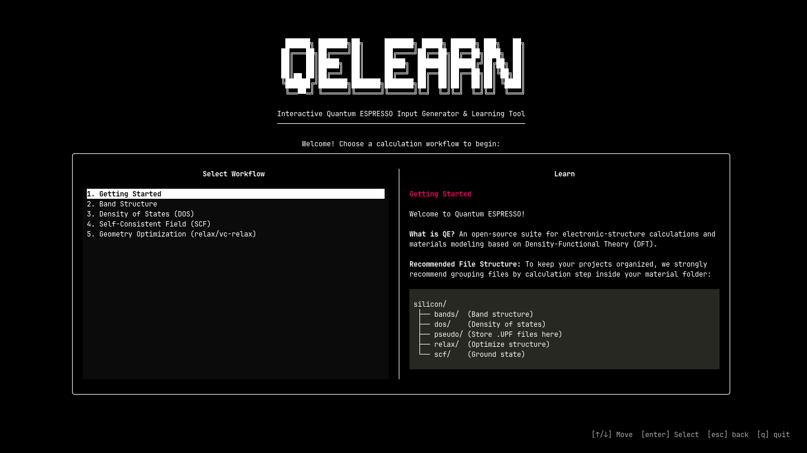

# ⚛️ QELearn 

**An intuitive and interactive way to learn and generate Quantum ESPRESSO input files directly from your terminal!**

<div align="center">
  
</div>

Tired of copying, pasting, and breaking your `scf.in` files? Forgetting what `ecutwfc` or `conv_thr` actually does? **QELearn** is an interactive, terminal-based GUI (TUI) designed to hold your hand through the magical world of Density-Functional Theory (DFT) calculations. 

Whether you're just starting your computational materials journey or you're a seasoned researcher who just wants to generate quick templates for Band Structures, DOS, or Geometry Relaxations—QELearn has got you covered! 🚀

---

## ✨ Features
- **🎮 Interactive Terminal GUI:** Navigate with your keyboard (Arrows, Enter, Esc). No mouse required!
- **🧙‍♂️ Smart Wizard:** Automatically applies the right physics parameters based on your material's dimensionality (2D vs 3D) and electronic nature (Metal vs Insulator).
- **📚 Built-in Tutor:** A side-panel that actively explains what every single parameter does as you type. 
- **💾 Auto-Save Magic:** Just hit `Ctrl+S` and watch it instantly generate your `scf.in`, `nscf.in`, and `bands.in` all at once in your current folder!

---

## 🛠️ Installation

You can install `qelearn` directly from GitHub. It automatically registers a global command, meaning you can summon it from *any* folder on your computer.

Run this simple command anywhere in your terminal:
```bash
pip install git+https://github.com/jauhar-nr/qelearn.git
```

---

## 🚀 How to Use

Once installed, simply open your terminal, navigate to the folder where you want to save your Quantum ESPRESSO files, and type:

```bash
qelearn
```

Happy computing! 💻✨
